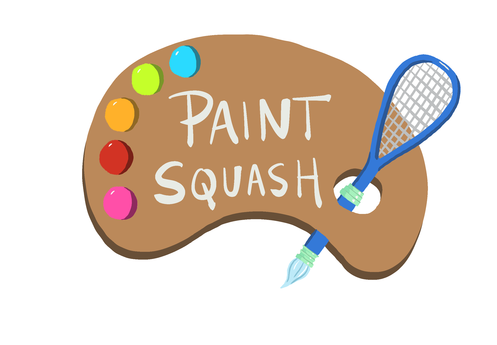

# Paint Squash VR Documentation
Megan Reddy, Nick Moon, Rhuta Joshi 
CIS 568 Game Design: VR Project  

| PaintSquashVR |
|---|
||
|[Watch trailer](https://youtu.be/A-dZ14WgZu0)|
|[Watch gameplay](https://youtu.be/qbftf0uzTgc)|

## Set-up and Configuration 
__NOTE: This game has been developed, tested, and designed for the Windows 10/11 and HTC Vive Pro 2 platforms only. Using any other setup is beyond the scope of this game.__
1. Log-in the computer of your choice.
2. Plugin the necessary cables for the VR headset and controllers. This should be a power cable, USB cable, and display cable that plug into a brick that connects the VR headset to the PC. Then 2 USB power cables to charge the controllers.
3. Also make sure that the VR detection towers are set up properly.
4. Start SteamVR, and go to Room Setup. Then choose Room-Scale setup, and complete this setup, following the instructions accordingly. The size of the room should be such that you have enough room to move around a bit.
5. Make sure the resolution is lowered a bit in the case of lower-end hardware.
6. Download and launch the PaintSquashVR executable. The game should automatically detect the headset and controllers, and you should be in the game.

## User Guide
### Overview
- This is a VR sports game based on racket sports and featuring full room-based movement
- The game is played from a first person perspective, with a racket in the players hand
- The goal of the game is to beat all the levels as fast as possible, where each level features a blank canvas the player must fill in by hitting paintball projectiles towards the canvas.
### Gameplay
- The player has a racket. The length of the racket can be extended or shrunk to fit player preference
- Each level features a blank canvas with a line drawing, in which each section of the line drawing has a color that that whole section must be filled with.
- Cannons at the top of the court fire paintballs towards the player. The possible paintballs are the following:
  - Paint Balls: These can be any color that is needed to fill the canvas
  - Palette Balls: These can act as any color, and fill in the section they hit with the correct color for that section
  - Eraser Balls: These erase any section they come into contact with. The player should avoid these in order to prevent their progress in the level from being deleted.
  - Homing Balls: These help the player aim. They fly towards a correct section for their color at a fast speed. However, they only successfully reach that section if the player hits them in the neighborhood of the area!
- The player must use the racket in their hand to hit the paintballs being fired at them. More specifically, the player should try to hit the balls to fill the complete canvas correctly.
- If a section of the canvas is filled with the right color, it is locked, and cannot be changed, unless hit by an eraser ball, which will reset it to white.
- If a section of the canvas is filled with the wrong color, it takes on that color, but that color will fade shortly to indicate it is the wrong color.
- If all the sections are filled, the level is one.
### Player Input
- Turning the VR Headset turns the camera with full 360 degree support
- Moving with the VR Headset on moves the player in the game with one-to-one movement.
- Moving the controller with the racket moves the racket with one-to-one movement.
- The pause button on the controller that doesn’t hold the racket brings up the pause menu.
- The right trigger on the controller with the racket is used to select menu options. This controller will act as a laser pointer with one-to-one movement. In the menus, the racket will momentarily disappear to make room for this functionality.

## Main Gameplay Features
### VR Movement and Racket
- Walk around in the virtual space, with 1-to-1 movement matching - Used the VR Template in Unreal Engine 5.1
- Swing HTC Vive controllers to swing PaintSquash Racket
- Player can use the racket to hit/redirect incoming paintballs towards the canvas
### Cannons
- Shooting paintballs at regular alternating intervals
- Cannon rotations within a small cone range
- Cannon timers to indicate when the next paintball is shot
- Cannon bands showing the color of next paintball to be fired by the cannon
### Canvas
- Canvas made up of sections, each section border showing expected/reference color
- Paintballs not matching reference colors get absorbed (applied color shows fading effect)
- Correctly filled color gets locked in unless cleared by eraser balls as described below.
### Paintballs
- Paintballs of colors to be filled on canvas, chosen randomly but proportional to number of sections having that color on canvas
- Special balls - Tuned to player performance, if the players consistently fail to fill the canvas correctly, more special balls will appear.
  - Palette balls - These balls filled any section with correct color
  - Homing balls - These balls are homing projectiles directly targeting the correct unfilled section on canvas after racket hit
  - Eraser balls - These clear an already filled canvas section
### Leaderboard
- Maintaining best scores for each level for each difficulty setting
- Data persistent every time the game is started, with an option to clear all leaderboard data as well
### Detailed Tutorial Design
- User instructions, graphics, buttons and information placed in the VR world
- Step by step guidance and un-timed practice sessions for various levels of difficulty
### Other UI elements:
- Timer in the VR world showing current time in minutes and seconds
- Guiding lines to help user identify the center for positioning
- Main menu area designed as a locker room for users to walk around, view leaderboard and change player settings
### Level Design
- User has three main levels to play apart from the tutorial

## Technical Issues
We did not encounter a large amount of technical issues while developing the game
- One minor issue was that we had to set the resolution of the HTC Vive Pro 2 to be at one of the lowest settings, or Unreal would slow down or crash consistently.
- Upon launching our game in VR and exiting from the game for the first time after every room setup, the VR headset would be in the ground of the Steam apartment home menu. This was a minor inconvenience.
- We attempted to have a custom Windows icon for our game, but it caused the build process to fail. We had to revert to the default Unreal logo instead.
- One time we disconnected the headset without exiting steamVR first. This caused the entire computer to be unresponsive. It required a hard reset (holding the power button down for 10 seconds) to reboot.
Overall, using Unreal Engine 5 with HTC Vive Pro 2 was very easy to develop for!

## Assets/Software
- VR Template for Unreal Engine 5.0  - It included encapsulated logic for teleport locomotion, an example VR spectator Blueprint and common input actions, such as grabbing and attaching items to your hand. (https://docs.unrealengine.com/5.0/en-US/vr-template-in-unreal-engine/)
- Music and sounds effects from Epidemic Sounds (https://www.epidemicsound.com/)
- Dear My Ocean (Instrumental) by Adelyn Paik
- Disco-Tech by Heyson
- Pistachio Ice Cream by Heyson
- Pool Sticker by Dylan Sitts
- San Fran by Rocket Jr.
- Say It Now by FLYIN
- Wings of Tomorrow by Rymdklang Soundtracks
- Textures
- All other textures included with Unreal Engine 5
- Custom art assets created with IPad painting app Procreate https://procreate.com/
- 3D models created in Autodesk MAYA https://www.autodesk.com/products/maya/overview
